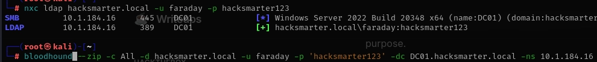
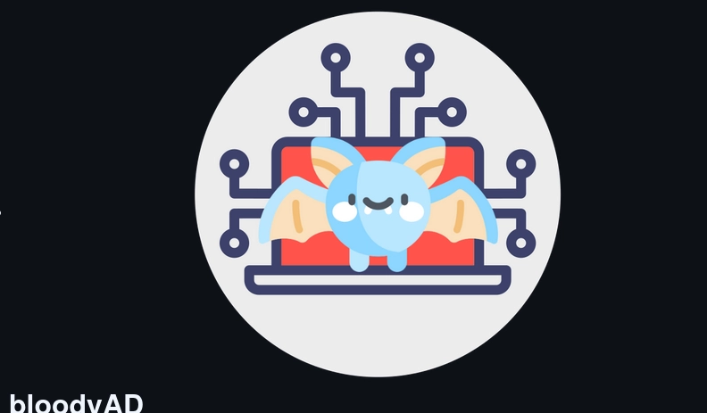
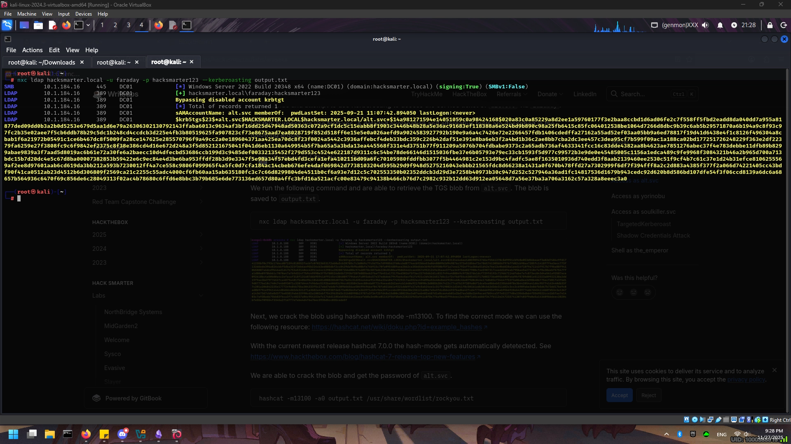
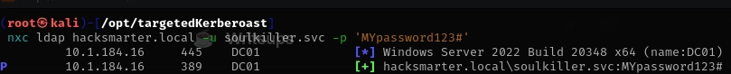

# Arasaka (easy)

## Scenario 

author of the machine/lab: Henry Lever.

#### Starting Credentials 

faraday:hacksmarter123

#### Objective and Scope 

You are a member of the Hack Smarter Red Team. This penetration test will operate under an assumed breach scenario, starting with valid credentials for a standard domain user, `faraday`.

The primary goal is to simulate a realistic attack, identifying and exploiting vulnerabilities to escalate privileges from a standard user to a Domain Administrator.

A quick CTF with my notes:&#x20;

### Enumeration

nxc ldap hacksmarter.local -u faraday -p hacksmarter123

<figure><figcaption></figcaption></figure>

bloodhound --zip -c All -d hacksmarter.local -u faraday -p 'hacksmarter123' -dc DC01.hacksmarter.local -ns ip addr

<figure><figcaption></figcaption></figure>

upload time\~ (Meaning we take the information and turn it into a zip file so we can use it to find out more information, and find important users.

<figure><figcaption></figcaption></figure>

alt.svc:babygirl1

<figure><figcaption></figcaption></figure>

<figure><figcaption></figcaption></figure>

we can do remote admin! which means the faraday user is pwnable.

<figure><figcaption></figcaption></figure>

<figure><figcaption></figcaption></figure>

yorinobu:newP@ssword2022

<figure><figcaption></figcaption></figure>

<figure><figcaption></figcaption></figure>

soulkiller.svc has shares!&#x20;

[soulkiller.py](http://soulkiller.py/)

#### Will Finish putting the photos of these at a later date:

local domain hash!

Hash for svc killer.

works.

Emperor Pwned NTDS.dit dumped:

Finished Arasaka.
