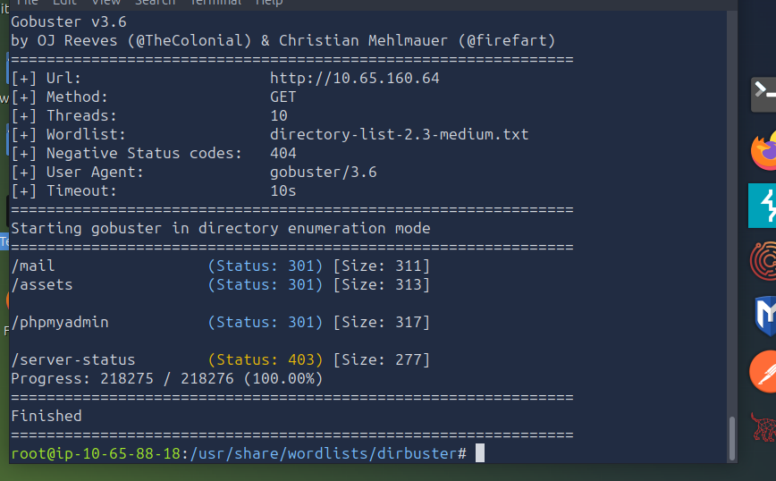

# TryHackMe: Recruit

**Recruit** has just launched its new recruitment portal, allowing HR staff to manage candidate applications and administrators to oversee hiring decisions. While the platform appears functional, management suspects that security may have been overlooked during development. Your task is to assess the application like a real attacker, mapping its structure, abusing exposed functionality, and exploiting vulnerabilities.


Recon:

gobuster dir -u http://ip addr -w /usr/share/wordlists/dirbuster/medium-list.txt

<figure><figcaption></figcaption></figure>

Mail&#x20;

<figure><figcaption></figcaption></figure>

Can run a local file, I am sure there are other methods here too.

<figure><figcaption></figcaption></figure>

Gives HR password: hrpassword123

Can check these out but I will return to the API config earlier that I saw


```
file.php?cv=file://config.php

```

— I will finish this later —&#x20;
